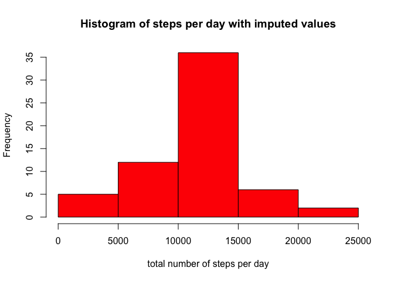
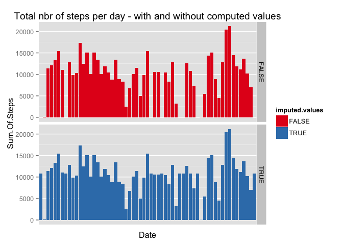

# Reproducible Research: Peer Assessment 1


## Loading and preprocessing the data

##### 1. Load the data (i.e. read.csv())


```r
activity <- read.csv("activity.csv")
```

##### 2. Process/transform the data (if necessary) into a format suitable for your analysis 

First, call libraries dplyr & lubridate

```r
library(dplyr)
```

```
## 
## Attaching package: 'dplyr'
## 
## The following object is masked from 'package:stats':
## 
##     filter
## 
## The following objects are masked from 'package:base':
## 
##     intersect, setdiff, setequal, union
```

```r
library(lubridate)
library(ggplot2)
```
*At this point, no further processing/transforming is needed.*


## What is mean total number of steps taken per day?

##### 1. Make a histogram of the total number of steps taken each day

Summarise the data per day and set readable column names

```r
sum.of.steps<-summarise(group_by(activity,date),sum(steps, rm.na=TRUE))
names(sum.of.steps)<-c("Date","Sum.Of.Steps")
```
Create the histogram

```r
hist(sum.of.steps$Sum.Of.Steps, col="blue",xlim=c(0,25000), main = "Histogram of steps per day", xlab="total number of steps per day")
```

 


##### 2. Calculate and report the mean and median total number of steps taken per day

Calculating the mean number of total steps per day...

```r
mean.steps<-mean(sum.of.steps$Sum.Of.Steps, na.rm=TRUE)
print(mean.steps)
```

```
## [1] 10767.19
```
....and the median number of total steps per day.

```r
median.steps<-median(sum.of.steps$Sum.Of.Steps, na.rm=TRUE)
print(median.steps)
```

```
## [1] 10766
```

## What is the average daily activity pattern?
##### 1. Make a time series plot (i.e. type = "l") of the 5-minute interval (x-axis) and the average number of steps taken, averaged across all days (y-axis)

First calculate the total number of steps per 5-minute interval divided by the distinct number of days and set readable column names.

```r
sum.of.steps.int<-summarise(group_by(activity,interval),sum(steps, na.rm=TRUE)/n_distinct(date))
names(sum.of.steps.int)<-c("interval","Sum.Of.Steps")
```

Next create the time-series plot.

```r
plot(type="l",sum.of.steps.int$interval,sum.of.steps.int$Sum.Of.Steps, xlab="5-minute interval", ylab="Avg number of steps taken", main="Avg number of steps per 5-minute interval" )   
```

 


##### 2. Which 5-minute interval, on average across all the days in the dataset, contains the maximum number of steps?

The 5-minute interval containing the maximum number of steps is:

```r
filter(sum.of.steps.int,Sum.Of.Steps==max(Sum.Of.Steps))
```

```
## Source: local data frame [1 x 2]
## 
##   interval Sum.Of.Steps
## 1      835     179.1311
```

## Imputing missing values

##### 1. Calculate and report the total number of missing values in the dataset (i.e. the total number of rows with NAs)

The total number of rows containing NA's is:

```r
sum(is.na(activity$steps))
```

```
## [1] 2304
```

##### 2. Devise a strategy for filling in all of the missing values in the dataset. The strategy does not need to be sophisticated. For example, you could use the mean/median for that day, or the mean for that 5-minute interval, etc.

Strategy:   
- Create a copy of the activity dataset   
- Create a dataset with the average number of steps per interval
- Create a dataset with the index of missing values
- Replace NA-values in the new dataset with the calculated average for that time interval using a loop function


##### 3. Create a new dataset that is equal to the original dataset but with the missing data filled in.

```r
# create the copy of existing dataframe
activity.imputed<-activity

# Calculate the average number of steps per interval, excluding NA values   
mean.of.steps.per.interval<-summarise(group_by(activity.imputed,interval),mean.of.steps=mean(steps, na.rm=TRUE))

# Create a index of missing values 
na.steps<-which(is.na(activity.imputed$steps))

# Replace the NA-values using a loop function

for (i in na.steps) {activity.imputed$steps[i]<-with(mean.of.steps.per.interval,mean.of.steps[interval==activity.imputed$interval[i]])}
```
##### 4. Make a histogram of the total number of steps taken each day and Calculate and report the mean and median total number of steps taken per day. Do these values differ from the estimates from the first part of the assignment? What is the impact of imputing missing data on the estimates of the total daily number of steps?

##### Make a histogram of the total number of steps taken each day
Summarise the data per day and set readable column names

```r
sum.of.steps.imputed<-summarise(group_by(activity.imputed,date),sum(steps, rm.na=TRUE))
names(sum.of.steps.imputed)<-c("Date","Sum.Of.Steps")
```
Create the histogram

```r
hist(sum.of.steps.imputed$Sum.Of.Steps, col="red",xlim=c(0,25000), main = "Histogram of steps per day with imputed values", xlab="total number of steps per day")
```

 

##### Calculate and report the mean and median total number of steps taken per day


Calculating the mean number of total steps per day...

```r
mean.steps.imputed<-mean(sum.of.steps.imputed$Sum.Of.Steps, na.rm=TRUE)
print(mean.steps.imputed)
```

```
## [1] 10767.19
```
....and the median number of total steps per day.

```r
median.steps.imputed<-median(sum.of.steps.imputed$Sum.Of.Steps, na.rm=TRUE)
print(median.steps.imputed)
```

```
## [1] 10767.19
```


##### Do these values differ from the estimates from the first part of the assignment?
The mean value remains the same, the median value increases slightly.

##### What is the impact of imputing missing data on the estimates of the total daily number of steps?

In order tot visualize the impact, first merge the dataframes with- and without the imputed values:

```r
sum.of.steps.merged<-bind_rows(mutate(sum.of.steps,imputed.values=FALSE),mutate(sum.of.steps.imputed,imputed.values=TRUE))
```

Next plot the two datasets (...and ingnore the warning). 
The plot demonstrates that imputing missing values does not appear to affect the *total nbr of steps per day* if values were present in the original dataset. It also demonstrates that imputing added values on specific dates. 

```r
ggplot(sum.of.steps.merged, aes(x=Date,y=Sum.Of.Steps, fill=imputed.values))+geom_bar(stat="identity") + facet_grid(imputed.values~.) + scale_fill_brewer(palette="Set1") + ggtitle ("Total nbr of steps per day - with and without computed values") + scale_x_discrete(breaks=NULL)
```

```
## Warning: Removed 8 rows containing missing values (position_stack).
```

 

## Are there differences in activity patterns between weekdays and weekends?


##### 1. Create a new factor variable in the dataset with two levels – “weekday” and “weekend” indicating whether a given date is a weekday or weekend day.

##### 2. Make a panel plot containing a time series plot (i.e. type = "l") of the 5-minute interval (x-axis) and the average number of steps taken, averaged across all weekday days or weekend days (y-axis). 
